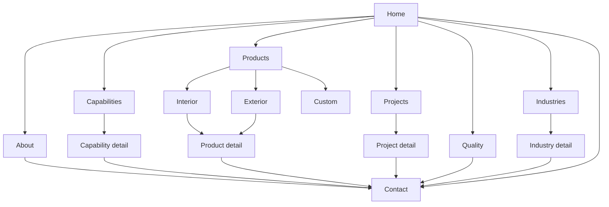

# Phase 2 — Sitemap & Page Hierarchy

**Brand positioning:** Hybrid — industrial-first (precision metal engineering & smart space systems; furniture + fabrication as product lines)  
**Primary conversion goals:** Request a Quote · Talk to Engineering · WhatsApp / Call  
**Design language:** Modern Industrial Luxury  
**Status:** Awaiting approval before Phase 3

---

## 1. Navigation model

### Primary (desktop + mobile)

| Label | Route | Purpose |
|---|---|---|
| Home | `/` | Brand, trust, capability snapshot, quote CTA |
| About | `/about` | Company story, vision/mission, leadership, scale |
| Capabilities | `/capabilities` | What we engineer / manufacture / deliver |
| Products | `/products` | Hub → Interior, Exterior, Custom |
| Projects | `/projects` | Proof of work & outcomes |
| Quality | `/quality` | Process, standards, infrastructure signals |
| Industries | `/industries` | Who we serve |
| Contact | `/contact` | Quote form + map + channels |

### Utility / persistent CTAs

| Element | Placement | Action |
|---|---|---|
| Request Quote | Header (primary button) + sticky mobile bar | `/contact?intent=quote` |
| Call | Header secondary / sticky | `tel:+918766526860` |
| WhatsApp | Floating + contact | Prefilled enquiry message |
| Download brochure | About / Capabilities / Footer (optional) | Asset or lead-gate placeholder |

### Footer IA

- Company: About · Quality · Projects · Careers (placeholder optional)
- Solutions: Capabilities · Products · Industries · Custom engineering
- Support: Contact · FAQ · Privacy · Disclaimer
- Connect: Address · Phone · Email · Social · WhatsApp

---

## 2. Full sitemap (URL hierarchy)

```
/
├── /about
│   └── (anchors) #story #mission #leadership #milestones #cta
├── /capabilities
│   ├── /capabilities/metal-fabrication
│   ├── /capabilities/laser-cutting
│   ├── /capabilities/smart-furniture-systems
│   ├── /capabilities/custom-engineering
│   └── /capabilities/installation-service
├── /products
│   ├── /products/interior
│   │   └── /products/interior/:slug
│   ├── /products/exterior
│   │   └── /products/exterior/:slug
│   └── /products/custom
├── /projects
│   └── /projects/:slug
├── /quality
│   └── (anchors) #standards #process #infrastructure #inspection
├── /industries
│   └── /industries/:slug
├── /contact
├── /privacy-policy
├── /disclaimer
├── /robots.txt
└── /sitemap.xml
```

**MVP build note (Phase 6):** Ship all **parent pages** + shared section components first. Child capability/product/project/industry detail templates can use shared layouts with content stubs, then fill progressively.

---

## 3. Page-by-page hierarchy & section purpose

Every section must: **build trust · show expertise · prove capability · drive enquiry**. Each section ends with a clear CTA path.

### 3.1 Home `/`

| Order | Section | Purpose | Ends with CTA |
|---|---|---|---|
| 1 | **Nav** | Wayfinding + always-on Quote | Request Quote |
| 2 | **Hero** | Precision / engineering authority; mission signal | Request Quote + Explore Capabilities |
| 3 | **Trust bar** | Years · product lines · clients · Nashik base (facts, not fluff) | View Projects |
| 4 | **About teaser** | Who we are in 3 lines + mission | About Artistic Engineers |
| 5 | **Why us** | Differentiation: quality, customization, durability, engineering mindset | Talk to Engineering |
| 6 | **Capabilities / Services** | Fabrication, laser, smart systems, custom, install | View all capabilities |
| 7 | **Industries** | Homes, offices, hospitality, institutional, commercial | See industries |
| 8 | **Featured projects** | 3–6 case proofs with outcome tags | View all projects |
| 9 | **Infrastructure snapshot** | Plant / tools / capacity signals | Quality & infrastructure |
| 10 | **Quality** | Standards, inspection, materials discipline | Our quality system |
| 11 | **Clients** | Logo wall with names + optional sector tags | Request similar work |
| 12 | **Testimonials** | Verified quotes (fix Altruistic error) | Get a quote |
| 13 | **Process** | Enquire → Design → Manufacture → Deliver → Support | Start your project |
| 14 | **Contact / Quote band** | Short form or jump to full contact | Submit enquiry |
| 15 | **Footer** | Full IA + compliance | Contact / WhatsApp |

### 3.2 About `/about`

| Order | Section | Purpose | CTA |
|---|---|---|---|
| 1 | Hero | Company identity + “Expanding The Space To Perform” | Request Quote |
| 2 | Story | Est. 2018, Nashik, smart furniture + metal engineering | — |
| 3 | Vision & Mission | Elevated, credible rewrite (keep DNA) | — |
| 4 | What we stand for | Values: precision, durability, customization, service | — |
| 5 | Leadership / team (optional stub) | Human trust | — |
| 6 | Milestones / scale | Timeline or stats | View capabilities |
| 7 | CTA band | Partnership / institutional enquiry | Contact |

### 3.3 Capabilities `/capabilities` (+ children)

| Order | Section | Purpose | CTA |
|---|---|---|---|
| 1 | Hero | “Engineering. Fabrication. Delivery.” | Request Quote |
| 2 | Capability grid | 5 pillars with icons + short proof | Open pillar |
| 3 | How we work | Cross-link to process | Start enquiry |
| 4 | Related projects | Proof per capability | View projects |
| 5 | CTA | Spec discussion | Talk to Engineering |

**Child pages** (`metal-fabrication`, `laser-cutting`, `smart-furniture-systems`, `custom-engineering`, `installation-service`):  
Hero → Scope → Materials/process → Applications → Related products/projects → Quote CTA

### 3.4 Products hub `/products`

| Order | Section | Purpose | CTA |
|---|---|---|---|
| 1 | Hero | Engineered products for interior & exterior | Request Quote |
| 2 | Category cards | Interior · Exterior · Custom | Browse category |
| 3 | Featured SKUs | High-intent bestsellers with real links | View product / Enquire |
| 4 | Custom band | “Don’t see it? We engineer it.” | Custom enquiry |

#### Interior `/products/interior`

Catalog of smart/space-saving furniture (from existing inventory). Each product detail: gallery, specs, use cases, customization notes, **Enquire on this product**.

#### Exterior `/products/exterior`

Doors, shades, laser-cut metal work. Same detail pattern; emphasize fabrication quality.

#### Custom `/products/custom`

Brief form: need → site type → timeline → upload (optional) → submit.

### 3.5 Projects `/projects`

| Order | Section | Purpose | CTA |
|---|---|---|---|
| 1 | Hero | Proof of delivery | Discuss your project |
| 2 | Filters | Industry / capability / product type | — |
| 3 | Project grid | Cards with outcome tags | Open case |
| 4 | CTA | Similar scope | Request Quote |

**Project detail `/projects/:slug`:** Challenge → Solution → Scope → Outcome → Gallery → Related → Quote CTA  
*(Initial content can use anonymized / placeholder cases until real photos/stories are supplied.)*

### 3.6 Quality `/quality`

| Order | Section | Purpose | CTA |
|---|---|---|---|
| 1 | Hero | Quality as engineering discipline | — |
| 2 | Standards & materials | What we commit to | — |
| 3 | Process & inspection | Incoming → in-process → final | — |
| 4 | Infrastructure | Tools, shop floor, capacity signals | — |
| 5 | CTA | Audit / visit / RFQ | Schedule discussion |

### 3.7 Industries `/industries`

| Order | Section | Purpose | CTA |
|---|---|---|---|
| 1 | Hero | Sector expertise | — |
| 2 | Industry cards | Residential · Office · Hospitality · Institutional · Commercial / retail · Custom OEM | Explore |
| 3 | CTA | Sector-specific enquiry | Request Quote |

**Industry detail:** Needs we solve → Typical products/capabilities → Sample projects → CTA

### 3.8 Contact `/contact`

| Order | Section | Purpose | CTA |
|---|---|---|---|
| 1 | Hero | “Request a quote” / “Talk to engineering” | — |
| 2 | Quote form (RHF + Zod) | Intent, name, phone, email, company, category, message, optional file | Submit |
| 3 | Direct channels | Phone, WhatsApp, email, address | Click-to-call / chat |
| 4 | Map | Existing Nashik location embed (modernized) | Directions |
| 5 | FAQ (short) | Lead-time, customization, visit | — |

**Form intents:** Support · Suggestion · Enquiry · Quote · Other (upgrade from current)

### 3.9 Legal

- `/privacy-policy` — rewrite clean semantic page  
- `/disclaimer` — rewrite clean semantic page

---

## 4. Homepage vs deep-page relationship



All deep pages terminate at **Contact / Quote** (or WhatsApp/Call as parallel paths).

---

## 5. Redirect map (from current URLs)

| Old | New |
|---|---|
| `/` | `/` |
| `/about-us/` | `/about` |
| `/interiour-products/` | `/products/interior` |
| `/exteriour-products/` | `/products/exterior` |
| `/art-crafts-products/` | `/products` (or retire; fold into custom/interior) |
| `/contact-us/` | `/contact` |
| `/privacy-policy/` | `/privacy-policy` |
| `/disclaimer/` | `/disclaimer` |

---

## 6. Primary user journeys

1. **Institutional / B2B buyer:** Home → Capabilities or Projects → Quality → Request Quote  
2. **Product shopper:** Home → Products → Category → Product → Enquire on this product  
3. **Custom need:** Home → Custom / Contact → Quote form (intent=custom) → WhatsApp follow-up  
4. **Local visit:** Contact → Map / Call / WhatsApp

---

## 7. SEO URL & naming rules

- Correct spelling: **Interior** / **Exterior** (never Interiour/Exteriour)
- Kebab-case slugs; English primary
- One H1 per page; breadcrumbs on all non-home pages
- Schema plan (Phase 7): Organization, LocalBusiness, WebSite, BreadcrumbList, Product (where applicable), FAQPage on Contact

---

## 8. Content gaps to fill later (not blockers for IA)

| Gap | Interim approach |
|---|---|
| Real project case studies | Structured placeholders with honest “representative work” labeling until assets arrive |
| Certifications | Show process/inspection discipline; add certs when available |
| Leadership photos | Optional section; omit if no assets |
| Art & crafts line | Deprioritize vs fabrication + smart furniture |
| Brochure PDF | CTA can collect lead or link when ready |

---

## Phase 2 status

**Deliverable complete.** Awaiting your approval to proceed to **Phase 3 — Component architecture + design system (tokens)**.
